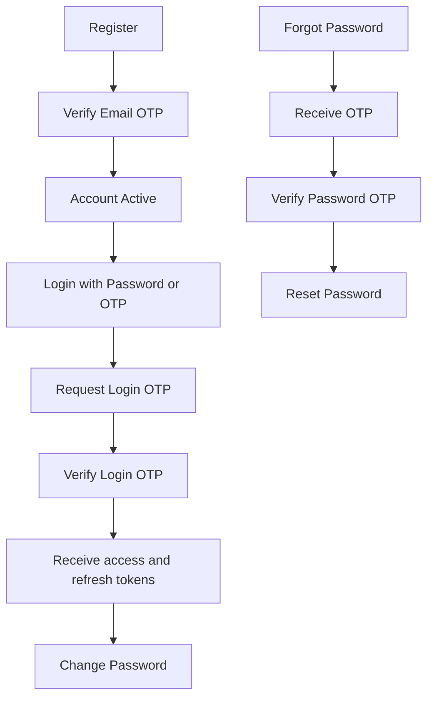

# CyberLearnix Auth API Guide for UI Team

This document is a UI handoff for authentication APIs exposed via API Gateway.

## 1) Base Setup

- Base URL (Docker): `http://localhost:8080`
- Auth base path: `/api/v1/auth`
- Content-Type: `application/json`
- Authorization header (where needed): `Bearer <accessToken>`

## 2) UI Flow Summary



## 3) Standard Response Pattern

Most endpoints return JSON with these fields:
- `success`: boolean
- `message`: string
- `timestamp`: datetime string
- `data`: object (only for some endpoints)

Token endpoints can return nested objects like `user`, `authentication`, `sessionInfo`.

## 4) Endpoint Contracts

---

### 4.1 Register User

- Method: `POST`
- URL: `/api/v1/auth/register`
- Auth: Not required

Request body:

```json
{
  "email": "newuser@example.com",
  "password": "StrongPass@123",
  "confirmPassword": "StrongPass@123",
  "firstName": "John",
  "lastName": "Doe",
  "mobileNumber": "9876543210",
  "countryCode": "+91",
  "dob": "2000-01-10",
  "city": "Chennai",
  "state": "Tamil Nadu",
  "country": "India",
  "preferredLanguage": "English",
  "organization": "CyberLearnix",
  "skills": ["Java", "Spring Boot", "SQL"],
  "fieldOfStudy": "Computer Science",
  "highestQualification": "B.Tech"
}
```

Notes for UI:
- `skills` supports array or string. Array is recommended.
- `mobile` is accepted as alias for `mobileNumber`.

Success response (`201`):

```json
{
  "success": true,
  "message": "User registered successfully. OTP has been sent to email.",
  "data": {
    "id": "6f663b9c-2f79-4fb9-91de-8e91767e2a5d",
    "email": "newuser@example.com",
    "status": "PENDING_VERIFICATION",
    "role": "STUDENT",
    "countryCode": "+91",
    "effectiveRole": "STUDENT"
  },
  "timestamp": "2026-08-04T10:20:11.248"
}
```

Common failures:
- `400`: invalid request format (rare branch)
- `409`: validation/business errors like:
  - `Password is required`
  - `Password and Confirm Password do not match`
  - `Password is too weak`
  - `Invalid country code`
  - `Mobile number must be 6-12 digits`
  - `Email already registered`
  - `Mobile number already registered`

---

### 4.2 Verify Email OTP (Registration OTP)

- Method: `POST`
- URL: `/api/v1/auth/verify-email`
- Auth: Not required

Request body:

```json
{
  "email": "newuser@example.com",
  "otp": "123456"
}
```

Success response (`200`):

```json
{
  "success": true,
  "message": "OTP verified successfully",
  "data": {
    "id": "6f663b9c-2f79-4fb9-91de-8e91767e2a5d",
    "email": "newuser@example.com",
    "firstName": "John",
    "lastName": "Doe",
    "status": "ACTIVE",
    "role": "STUDENT"
  },
  "timestamp": "2026-08-04T10:22:44.020"
}
```

Also sets cookies:
- `accessToken` (HttpOnly, secure)
- `refreshToken` (HttpOnly, secure)

Common failures:
- `401`: invalid OTP
- `403`: account locked/suspended or too many failed OTP attempts
- `404`: user not found
- `410`: OTP expired

Error shape example:

```json
{
  "success": false,
  "message": "Invalid OTP",
  "data": {
    "remainingAttempts": 4,
    "expiresInSeconds": 210
  },
  "timestamp": "2026-08-04T10:23:01.102"
}
```

---

### 4.3 Request Login OTP

- Method: `POST`
- URL: `/api/v1/auth/login/otp/request`
- Auth: Not required

Request body:

```json
{
  "email": "otptestuser@example.com"
}
```

Success response (`200`):

```json
{
  "success": true,
  "message": "If the email exists, a login OTP has been sent",
  "otpSessionId": "6cf9270f-2f85-4601-b72e-7a7e1d9b6705",
  "otpType": "login",
  "expiresAt": "2026-08-04T10:30:00",
  "validForMinutes": 5,
  "cooldownSeconds": 30,
  "sessionStartedAt": "2026-08-04T10:25:00",
  "timestamp": "2026-08-04T10:25:00"
}
```

Common failures:
- `400`: `Email is required` or `Please provide a valid email address`
- `429`: `Please wait before requesting a new OTP`
- `404`: `User not found or not registered`
- `502`/`503`: admin downstream unavailable/error path

---

### 4.4 Verify Login OTP

- Method: `POST`
- URL: `/api/v1/auth/login/otp/verify`
- Auth: Not required

Request body (recommended):

```json
{
  "email": "otptestuser@example.com",
  "otpSessionId": "6cf9270f-2f85-4601-b72e-7a7e1d9b6705",
  "otp": "123456"
}
```

Important:
- `otpSessionId` is mandatory.
- `email` can be omitted for login OTP verify only (backend resolves via session ID).

Success response (`200`) returns token model:

```json
{
  "success": true,
  "message": "Login successful",
  "user": {
    "id": "6f663b9c-2f79-4fb9-91de-8e91767e2a5d",
    "email": "otptestuser@example.com",
    "firstName": "Test",
    "lastName": "User",
    "role": "STUDENT"
  },
  "authentication": {
    "accessToken": "<jwt>",
    "accessTokenExpiresIn": "15m",
    "refreshToken": "<jwt>",
    "refreshTokenExpiresIn": "30d"
  },
  "sessionInfo": {
    "loginTime": "2026-08-04T10:26:44",
    "ipAddress": "127.0.0.1",
    "device": "Mozilla/..."
  },
  "timestamp": "2026-08-04T10:26:44"
}
```

Common failures:
- `400`: `otpSessionId is required`, invalid OTP, expired OTP, session mismatch
- `401`: `Invalid OTP or email`
- `403`: account status restrictions

---

### 4.5 Forgot Password (Send OTP)

- Method: `POST`
- URL: `/api/v1/auth/password/forgot`
- Auth: Not required

Request body:

```json
{
  "email": "otptestuser@example.com"
}
```

Success response (`200`):

```json
{
  "success": true,
  "message": "If the email exists, a password reset OTP has been sent",
  "otpSessionId": "6ec5398b-9cc7-4d6f-b5cb-6f8f4fefa2ac",
  "otpType": "password_reset",
  "expiresAt": "2026-08-04T10:35:00",
  "validForMinutes": 5,
  "cooldownSeconds": 30,
  "sessionStartedAt": "2026-08-04T10:30:00",
  "timestamp": "2026-08-04T10:30:00"
}
```

Common failures:
- `400`: `Email is required`
- `429`: `Please wait before requesting a new OTP`

---

### 4.6 Verify Password Reset OTP

- Method: `POST`
- URL: `/api/v1/auth/password/verify-otp`
- Auth: Not required

Request body:

```json
{
  "email": "otptestuser@example.com",
  "otpSessionId": "6ec5398b-9cc7-4d6f-b5cb-6f8f4fefa2ac",
  "otp": "123456"
}
```

Important:
- Although DTO marks email optional, current backend path expects matching email with session.
- For UI, treat `email` as required.

Success response (`200`):

```json
{
  "success": true,
  "message": "OTP verified successfully",
  "otpSessionId": "6ec5398b-9cc7-4d6f-b5cb-6f8f4fefa2ac",
  "sessionValidatedAt": "2026-08-04T10:31:10",
  "timestamp": "2026-08-04T10:31:10"
}
```

Common failures:
- `400`: `otpSessionId is required`, invalid OTP, OTP already used, session mismatch/expired
- includes `remainingAttempts` when OTP is invalid

---

### 4.7 Reset Password

- Method: `POST`
- URL: `/api/v1/auth/password/reset`
- Auth: Optional (if access token provided, email can be inferred)

Request body:

```json
{
  "email": "otptestuser@example.com",
  "otpSessionId": "6ec5398b-9cc7-4d6f-b5cb-6f8f4fefa2ac",
  "newPassword": "NewStrong@123",
  "confirmPassword": "NewStrong@123"
}
```

Success response (`200`):

```json
{
  "success": true,
  "message": "Password reset successfully",
  "timestamp": "2026-08-04T10:32:40"
}
```

Common failures:
- `400`: missing request/body fields, password mismatch, email missing, otpSessionId missing
- `401`: `OTP session not verified or expired`
- `500`: downstream admin password reset failure

---

### 4.8 Change Password (Logged-in User)

- Method: `POST`
- URL: `/api/v1/auth/change-password`
- Auth: Required (`Authorization: Bearer <accessToken>`)

Request body:

```json
{
  "currentPassword": "OldStrong@123",
  "newPassword": "NewStrong@123",
  "confirmPassword": "NewStrong@123"
}
```

Success response (`200`):

```json
{
  "success": true,
  "message": "Password changed successfully",
  "timestamp": "2026-08-04T10:40:00"
}
```

Common failures:
- `401`: missing/invalid token, current password incorrect
- `400`: missing fields or password mismatch
- `500`: downstream admin password change failure

---

## 5) Additional Auth Endpoints (UI Usually Needs)

### 5.1 Login with Password
- `POST /api/v1/auth/login`
- Body: `{ "email": "...", "password": "..." }`
- Returns LoginResponse with tokens.

### 5.2 Refresh Token
- `POST /api/v1/auth/refresh`
- Header: `Authorization: Bearer <refreshToken>`

### 5.3 Logout
- `POST /api/v1/auth/logout`
- Header: `Authorization: Bearer <accessToken>`
- Optional body: `{ "refreshToken": "..." }`

## 6) UI Validation Rules (Recommended)

1. Email: valid email format.
2. OTP: exactly 6 digits.
3. Password (register/reset/change):
   - min 8 chars
   - at least 1 uppercase
   - at least 1 lowercase
   - at least 1 number
   - at least 1 special char
4. `otpSessionId`:
   - required for OTP verify and password reset flow.
5. Respect cooldown:
   - if API returns `429` and `cooldownSeconds`, disable resend until timer completes.

## 7) UI Test Cases Checklist

### Register + Verify Email OTP
- Register with valid payload and skills array -> `201`.
- Register duplicate email -> `409`.
- Register weak password -> `409`.
- Verify email OTP valid -> `200` and account ACTIVE.
- Verify wrong OTP -> `401` with remaining attempts.
- Verify expired OTP -> `410`.

### Login OTP
- Request OTP valid user -> `200` and `otpSessionId`.
- Request OTP invalid email format -> `400`.
- Request OTP too fast (resend) -> `429`.
- Verify OTP valid -> `200` + access/refresh token.
- Verify OTP without session ID -> `400`.
- Verify OTP wrong code -> `400`.

### Forgot/Reset Password
- Forgot password valid email -> `200` with generic success.
- Verify password OTP valid -> `200`.
- Verify password OTP wrong -> `400` with remaining attempts.
- Reset password without verified OTP session -> `401`.
- Reset password with mismatch -> `400`.
- Reset password success -> `200`.

### Change Password
- Change with valid token and current password -> `200`.
- Change with wrong current password -> `401`.
- Change with mismatched new/confirm -> `400`.
- Change without auth header -> `401`.

## 8) Notes for UI Team

1. Always call through API Gateway (`localhost:8080`), not direct microservice ports.
2. Keep OTP resend timer in UI (30 seconds from backend cooldown).
3. Keep OTP/session data per flow:
   - login OTP session ID separate from password reset OTP session ID.
4. Show backend `message` directly for now (it already differentiates many cases).
5. Use generic user-facing copy for unknown email cases where response is intentionally non-enumerating.
